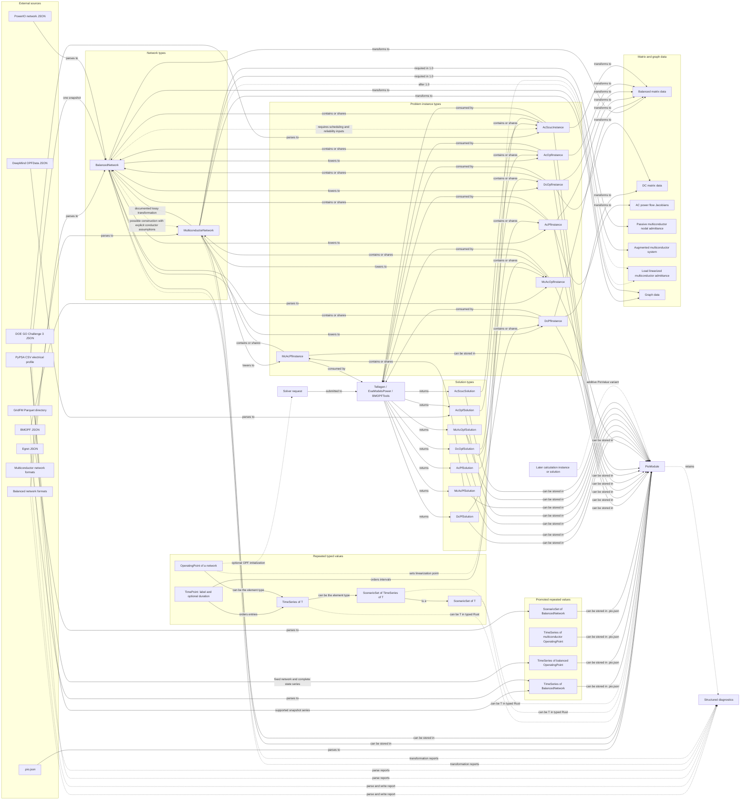
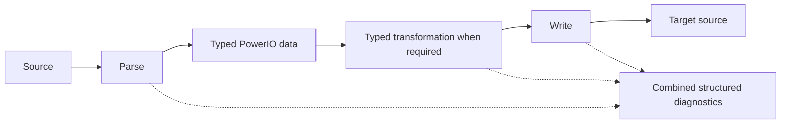

# PowerIO 1.0 ontology

Status: historical knowledge graph from the design work that informed PowerIO
0.10. It is not current API authority, a crate dependency diagram, or a list of
current implementation types.

The companion [PowerIO 1.0 issue audit](V1_ISSUE_AUDIT.md) maps these concepts
to the GitHub tracker.
The [PowerIO 1.0 terminology](V1_TERMINOLOGY.md) defines every repeated public
term used in this graph.

`PioModule<T>` is the accepted top level compiler type. Every successful parse
returns one. `.pio.json` serializes `PioModule<PioValue>`.

Here, “knowledge graph” means a controlled set of named entities connected by
explicit relations. The Mermaid diagram is the visual summary; the tables make
the same graph reviewable without the diagram. If machine readable ontology
data becomes useful, these nodes and edges can be serialized later without
changing the public API.

## Type and operation graph



An arrow states an allowed relation, not that the operation is lossless. Every
operation reports structured diagnostics. An operation that cannot produce a
meaningful target without more information asks for explicit inputs or fails.

Solid edges are implemented or accepted as part of the 1.0 shape. Dashed edges
are planned, conditional, or diagnostic associations. The direct
multiconductor matrix route and the route through a balanced equivalent have
different semantics and remain separate.

A source parser documents which part of an upstream format it supports, then
chooses the richest ontology node declared inside that profile. BMOPF and DOE
DOE GO Challenge 3 therefore produce problem instances rather than bare networks. The
nested network remains available through the instance accessor. A network
format does not become an instance solely because its data could be used to
construct several calculations. Stored solutions and sources with several
states require typed time series or scenario data instead of being hidden in
the retained `Source`.

A source instance does not restrict later use of its network.
`AcScucInstance` and `McAcOpfInstance` expose their network by reference and can
be transformed into another calculation instance when the required inputs are
present. The parse result records what the source declared; transformation
edges record what else can be constructed from it.

Each solution contains or shares the instance it solves. Instances
are immutable inputs and can have several results. Solver variables, factors,
and caches do not enter the solution type.

A solution is the primary module value when the source explicitly represents a
solved calculation, as DeepMind OPFData does. A network format that stores
voltages and setpoints still produces a network with an operating point unless
it states which calculation was solved and supplies the information needed to
interpret the result. A module does not carry a generic list of solutions.

An external collection is not an electrical model type. A `TimePoint` is only
an exact source label and optional nonnegative duration. Its position establishes
order; PowerIO does not guess calendar or time zone meaning. `TimeSeries<T>`
contains ordered values of `T`; `ScenarioSet<T>` contains named alternatives
with no implied order.
They compose as `ScenarioSet<TimeSeries<T>>`. A sequence of electrical states
uses `TimeSeries<OperatingPoint<N>>`. If network parameters, costs, or limits
change, `T` must be the network or calculation type that owns those fields.

The generic public types have private fields and ordinary borrowed access.
`TimeSeries<T>::get` returns `(&TimePoint, &T)` and scenario lookup returns a
named scenario by reference. Types such
as `OperatingPoint<N>` can be small owning handles into shared numerical
columns and an immutable cheap to clone network handle. No public type or trait
exposes the memory representation. A deterministic series is not
wrapped in `ScenarioSet<T>`, and a security constrained contingency is not
called a scenario.

Only the four repeated values shown in the promoted subgraph cross the 1.0
dynamic and `.pio.json` boundary. Other `TimeSeries<T>`, `ScenarioSet<T>`, and
nested compositions remain ordinary `PioModule<T>` values in typed Rust.

PyPSA investment periods are source specific planning data, not a generic
PowerIO type or module field. GridFM uses scenarios. Egret uses ordered time
points.
DeepMind OPFData collections contain independent solved AC OPF entries. The
representation shares one base network where the source identities permit it
without pretending these concepts have the same meaning.

The passive multiconductor result is the ordinary nodal admittance matrix. The
augmented result adds constraint rows for ideal equipment and therefore has a
separate result type. Load linearized admittance data is planned after 1.0; it
accepts typed operating point values and reuses the node ordering and sparse
structure across a fixed topology sequence.

`DcPfInstance` defines the calculation and remains separate from its derived
matrix data. That data includes `A`, `B`, `Bf`, the bus power injection, phase
shift injection, reference conditions, and stable mappings. AC power flow
Jacobians are also derived matrix data. One operation selects polar or Cartesian
coordinates and returns all power injection derivatives. Solver specific row,
column, and equation choices do not create new PowerIO matrix or instance types.

Graph data preserves every equipment identity and parallel edge. The current
balanced graph transformation already retains several branches between the same
two buses. A multiconductor graph transformation must also preserve conductor
terminals and equipment with more than two terminals; it does not replace
`MulticonductorNetwork` as the electrical model.

## Graph relations

| Relation | Meaning |
|---|---|
| parses to | Parses an external source and produces typed PowerIO data. |
| contains or shares | A problem instance exposes its reusable electrical network without a second public network representation. |
| shares | Repeated state data reuses one network across entries without copying it. |
| transforms to | Produces another typed value and diagnostics. |
| lowers to | Produces data for a specific calculation from reusable or more general typed data. A lowering is a transformation. |
| writes as | Emits a supported external format and diagnostics. |
| can be stored in | Stores the typed value as `PioModule.value`. |
| consumed by | Passes a problem instance to a solver without moving solver state into PowerIO. |
| returns | A solver converts its internal result into a PowerIO solution. |
| reports | Associates an operation with its structured diagnostics. |

These relation labels describe the graph. They are not proposed Rust function
names.

Public problem instances contain or share a typed network. Dense bus numbers,
parallel numerical columns, source row maps, and omitted row lists are private
matrix or solver preparation data, not public instance fields.

Durable references use module scoped symbolic identity:

```text
ElementId { kind: ElementKind, id: String }
```

The parser retains an upstream UID when one exists and otherwise synthesizes a
deterministic ID. Source row ordinals belong in source maps and private caches.
They never serve as serialized semantic identity.

`DcPfInstance`, `AcPfInstance`, and `McAcPfInstance` hold typed partial boundary
specifications. PQ, PV, reference, and multiconductor specifications leave the
quantities to be solved unknown. A complete `OperatingPoint<N>` is a power flow
solution value or an optional solver initial state, not required instance input.
A sequence resolves element identities once and updates reusable typed state
without serializing or cloning the shared network.

## Parsing

The Rust API has one public parse operation over a retained `Source`.

| Source constructor or operation | Accepted input | Output |
|---|---|---|
| `Source::open` | a supported file or directory path | retained `Source` |
| `Source::from_bytes` | one buffer's name and bytes | retained `Source` |
| `Source::with_format` | an explicit parser selection for ambiguous or mislabeled input | retained `Source` |
| `parse` | retained `Source` | `PioModule<PioValue>` |
| `module.into_typed::<T>()` | `PioModule<PioValue>` | one concrete `PioModule<T>` or recoverable `ValueKindMismatch` for advanced owned code |

The Rust shape is:

```rust
parse(source: Source) -> Result<PioModule<PioValue>, Error>

let module = parse(Source::open(path)?)?;
let network: PioModule<BalancedNetwork> = module.into_typed()?;
```

`PioValue` is the finite runtime sum used at the automatic parsing, disk, and
binding boundary because the source decides which declared value it contains.
It is not the set of every conceptual module value: typed Rust can use a
`PioModule<T>` that has not been promoted to the dynamic enum.
Ordinary code reads or matches `module.value()` directly. `into_typed` exists
for generic code that needs to move one concrete module without cloning. One
sealed facade `FromPioValue` implementation exists per built in variant;
successful narrowing moves the value and common records without allocation.
The trait performs extraction and does not constrain `PioModule<T>`. Standard
module-level `TryFrom` is not coherent across the crate split. There is no
`parse_as` operation and no public
function list that grows once for every value type. Python and Julia expose one
`parse` operation with an optional requested output type. A parsed module
retains its source; a module constructed in memory does not.
`Source` is an opaque owner or provider of named immutable byte buffers rather
than a public file or directory enum. A file can be memory mapped and a
directory format can acquire buffers as needed without changing the public API.
Without `with_format`, `parse` detects the format. With it, the selected parser
validates the source and reports malformed input as a parse failure.

## Supported source and target formats

### Balanced transmission data

| Format | Parse | Write | Typed value |
|---|---:|---:|---|
| MATPOWER file | yes | yes | `BalancedNetwork` |
| PowerModels JSON | yes | yes | `BalancedNetwork` |
| Egret JSON | yes | yes | `BalancedNetwork`, or `TimeSeries<BalancedNetwork>` when every time varying attribute belongs to the supported scalar network profile |
| PSS/E RAW file, versions 33, 34, and 35 | yes | yes | `BalancedNetwork` |
| PowerWorld AUX file | yes | yes | `BalancedNetwork` |
| PowerWorld PWB file | yes | no | `BalancedNetwork` |
| PowerWorld PWD display file | display API | display API | no `PioValue`; display and geo data only |
| pandapower JSON | yes | yes | `BalancedNetwork` |
| PyPSA CSV directory | yes | yes | 1.0 electrical profile: `BalancedNetwork`, `TimeSeries<BalancedNetwork>`, or `TimeSeries<OperatingPoint<BalancedNetwork>>`; non-electrical components, intertemporal calculation data, investment data, and stochastic data are retained and diagnosed outside the profile |
| PyPSA NetCDF | no | no | waits for source neutral multi-carrier, multi-period, capacity expansion, and stochastic types |
| PSLF EPC file | yes | yes | `BalancedNetwork` |
| Surge JSON | yes | yes | 1.0 electrical network profile: `BalancedNetwork` |
| DeepMind OPFData JSON | yes | no | `AcOpfSolution` containing or sharing `AcOpfInstance`; termination is `NotReported`, solution claim is source asserted, and residuals are computed |
| GridFM Parquet directory | yes | yes | `ScenarioSet<BalancedNetwork>` for the static bus, generator, branch, and Y-bus Parquet profile; dynamic Zarr trajectories, perturbation keys, and runtime metadata are outside the profile |

Full PyPSA is broader than one balanced network: it includes multiple carriers,
arbitrary port links and processes, snapshot indexed inputs and results,
investment periods, and stochastic optimization. PowerIO does not introduce a
source specific top level type for it. The 1.0 CSV electrical profile types
selected electrical component tables as `BalancedNetwork` and supported
snapshot-local series as a time series of networks or complete operating
points. Data outside that profile is retained for exact same format writing and diagnosed before a
cross-format projection. Complete PyPSA and NetCDF support waits for source
neutral types that preserve the missing semantics.

#### PyPSA CSV electrical profile

The 1.0 profile accepts these electrical component tables and columns. Missing
optional columns use PyPSA's documented defaults. With one snapshot and no
series file it produces `BalancedNetwork`. With several declared snapshots and
no varying series it preserves the declared axis as
`TimeSeries<BalancedNetwork>` whose entries share the same immutable network
data.

| File | Typed columns |
|---|---|
| `network.csv` | `name`; `powerio_base_mva` when written by PowerIO |
| `snapshots.csv` | ordered `snapshot` labels; weight columns are retained and diagnosed unless they state an unambiguous physical duration |
| `buses.csv` | `name`, `v_nom`, `v_mag_pu_set`, `v_mag_pu_min`, `v_mag_pu_max`, `x`, `y` |
| `loads.csv` | `name`, `bus`, `p_set`, `q_set`, `active` |
| `shunt_impedances.csv` | `name`, `bus`, `g`, `b`, `active` |
| `generators.csv` | `name`, `bus`, `control`, `p_nom`, `p_set`, `q_set`, `p_min_pu`, `p_max_pu`, `marginal_cost`, `marginal_cost_quadratic`, `active` |
| `lines.csv` | `name`, `bus0`, `bus1`, `r`, `x`, `g`, `b`, `s_nom`, `v_ang_min`, `v_ang_max`, `active` |
| `transformers.csv` | `name`, `bus0`, `bus1`, `r`, `x`, `g`, `b`, `s_nom`, `tap_ratio`, `phase_shift`, `active` |
| `storage_units.csv` | `name`, `bus`, `p_nom`, `max_hours`, `p_set`, `q_set`, `state_of_charge_initial`, `efficiency_store`, `efficiency_dispatch`, `active` |
| `links.csv` | `name`, `bus0`, `bus1`, `p_nom`, `p_set`, `p_min_pu`, `p_max_pu`, `efficiency`, `active`; maps to the supported two-terminal HVDC profile and reports missing reactive and voltage data |

The profile also accepts these snapshot-local series siblings:

| Component | Accepted varying columns |
|---|---|
| buses | `v_mag_pu_set`; complete state output `v_mag_pu`, `v_ang`, `p`, `q` |
| loads | `p_set`, `q_set`; state output `p`, `q` |
| generators | `p_set`, `q_set`, `p_min_pu`, `p_max_pu`, `marginal_cost`, `marginal_cost_quadratic`; state output `p`, `q`, `status` |
| lines | `s_max_pu`; state output `p0`, `q0`, `p1`, `q1` |
| transformers | `s_max_pu`, `phase_shift`; state output `p0`, `q0`, `p1`, `q1` |
| storage units | `p_set`, `q_set`, `p_min_pu`, `p_max_pu`, `efficiency_store`, `efficiency_dispatch`; state output `p`, `q` |
| links | `p_set`, `p_min_pu`, `p_max_pu`, `efficiency`; state output `p0`, `p1` |

The filenames are PyPSA's `<component>-<attribute>.csv` form. Supported input
series produce `TimeSeries<BalancedNetwork>`. If the network is fixed and the
source supplies the complete supported voltage, injection, equipment status,
and branch flow state for every snapshot, it produces
`TimeSeries<OperatingPoint<BalancedNetwork>>`. When parameters and state both
vary, each `BalancedNetwork` entry carries its source-declared state. Partial
result tables remain retained and diagnosed; PowerIO never infers that PyPSA
ran a particular calculation.

`stores.csv`, other component classes, unit commitment and ramp coupling,
storage energy balance and state history, investment periods, non-electrical
carriers, and stochastic data are outside this profile. Current PyPSA CSV
export explicitly refuses stochastic scenarios and directs those models to
NetCDF.

Upstream Egret `ModelData` uses `system.time_keys` as one ordered list of time
labels and permits a time series value on any attribute. Egret itself creates a
scalar snapshot by replacing every declared time series value with the selected
entry. PowerIO does the same when every varying attribute belongs to its scalar
network profile, producing `TimeSeries<BalancedNetwork>` with shared static
tables. It does not call a load schedule or varying limit a complete electrical
state. Unit commitment, reserve, contingency, and security data remains outside
the profile. Surge market and control data is also outside the 1.0 profile.

PyPSA snapshots, stochastic scenarios, and investment periods remain distinct
axes even when values happen to be identical. Snapshot-local costs, limits,
availability, and setpoints fit a time series of networks. Commitment, ramping,
storage history, investment, recourse, and risk data remain PyPSA calculation
data until source neutral calculation types can preserve them. None of these
inputs is mislabeled as an operating point.

MATPOWER and single network PowerModels JSON remain network inputs. Both carry
enough bounds and cost data to construct an
AC OPF instance, but neither source commits the caller to AC OPF: the same
data feeds power flow, DC OPF, and other calculations. Ratings, capability
bounds, stored state, and cost curves remain reusable data; the instance
selects enforced constraints and an objective. Generalized MATPOWER
optimization fields and PowerModels multinetwork data need separately named
profiles.

### Distribution data

| Format | Parse | Write | Typed value |
|---|---:|---:|---|
| OpenDSS file | yes | yes | static circuit profile: `MulticonductorNetwork`; schedules, solve commands, and output requests outside that profile are retained and diagnosed |
| PowerModelsDistribution engineering JSON | yes | yes | `MulticonductorNetwork` |

### Problem data

| Format | Parse | Write | Typed value |
|---|---:|---:|---|
| DOE GO Challenge 3 JSON | yes | no | `AcScucInstance` containing `BalancedNetwork` |
| BMOPF JSON | yes | yes | `McAcOpfInstance` containing `MulticonductorNetwork` |

The BMOPF specification defines both the conductor resolved network and an
optimization problem: voltage and current limits, generator bounds, per phase
generation costs, equations, and an objective. Current PowerIO stores much of
that input on `MulticonductorNetwork`. `McAcOpfInstance` is the confirmed public
type. `Mc` follows PowerModelsDistribution's `solve_mc_opf`; `AcOpf` identifies
the underlying problem independently of a polar, Cartesian, current voltage,
SOC, or SDP solver representation.

Per terminal voltage bounds, per phase generator costs, and conductor resolved
limits remain exact arrays on `MulticonductorNetwork`. The 1.0 parser removes
the current scalar collapses. `McAcOpfInstance` shares the network instead of
copying those arrays.

OpenDSS distinguishes a circuit, schedules such as `LoadShape`, solution mode
and control instructions, monitor and meter output, QSTS state samples, and
dynamic simulation state. Parsing a `.dss` script does not claim that a solve
occurred. The 1.0 static profile produces `MulticonductorNetwork`; schedules,
calculation instructions, and output requests outside that profile remain retained
for exact writing and produce an uninterpreted profile diagnostic. The dynamic
boundary accepts and stores
`TimeSeries<OperatingPoint<MulticonductorNetwork>>` when another source or
simulator result supplies complete sampled electrical states. A QSTS instance
or solution receives its own named type before PowerIO claims QSTS interchange;
dynamic simulation remains a separate later profile.

### PowerIO module

| Serialization | Parse | Write | Meaning |
|---|---:|---:|---|
| PowerIO network JSON | yes | yes | serialization of one network type; not a source format |
| `.pio.json` | yes | yes | versioned serialization of `PioModule<PioValue>` |

Each `PioModule` contains exactly one typed `value`. The 1.0 document stores a
producer, source artifacts, source map, diagnostics, and history. A repair or
explicit edit is a history operation; validation runs and derived summaries
are not common stored records. The dynamic enum supports several types, but a
`PioModule` never contains several competing primary values.

## Additional external formats and standards

The following sources expand the exchange graph without adding internal network
types.

| External format or profile | Source shape | PowerIO value | Status |
|---|---|---|---|
| CGMES based on IEC 61970 | file or directory | `BalancedNetwork` | open issue and experimental branch |
| IEC 61968 distribution CIM | file or directory | `MulticonductorNetwork` | open issue and experimental branch |
| MG-RAVENS balanced profile | file | `BalancedNetwork` | open issue and experimental branch |
| MG-RAVENS conductor level profile | file | `MulticonductorNetwork` | open issue and experimental branch |
| PowerFactory DGS | file | `BalancedNetwork` or `MulticonductorNetwork` selected from source content | open issue; balanced and conductor resolved parsers exist on experimental branches |
| PSS/E RAWX | file | `BalancedNetwork` | candidate identified from PowerMCP |
| PowSyBl IIDM | file | `BalancedNetwork` | candidate identified from PowerMCP |
| UCTE | file | `BalancedNetwork` | candidate identified from PowerMCP |

[CGMES](https://www.entsoe.eu/data/cim/cim-for-grid-models-exchange/) is an
external exchange profile based on IEC 61970. CIM distribution profiles based
on IEC 61968 map to `MulticonductorNetwork`. CIM is not a third
PowerIO network types.

[MG-RAVENS](https://github.com/lanl-ansi/MG-RAVENS) defines exchange between
grid modeling and analysis tools. Its balanced and conductor level profiles
map to the corresponding PowerIO network types rather than becoming a new
internal model.

The PowerMCP inventory also includes vendor binary or project formats such as
PSS/E SAV, PSLF SAV, and PowerFactory PFD. These are not recommended native 1.0
parser targets without open specifications. PowerFactory DGS is the portable
PowerFactory target. Pandapower pickle is Python specific and unsafe to load
from untrusted sources; pandapower JSON remains the exchange target.

Open implementation trackers:

- [CGMES and CIM issue](https://github.com/eigenergy/powerio/issues/237)
- [MG-RAVENS issue](https://github.com/eigenergy/powerio/issues/27)
- [PowerFactory DGS issue](https://github.com/eigenergy/powerio/issues/150)

DGS is not supported on current main. The closed draft PR implemented a
positive sequence parser into `BalancedNetwork`. A later experimental fork
also implements a `MulticonductorNetwork` parser. That parser preserves
explicit natural coordinate conductor matrices and neutral conductors; when
only sequence values are available, it constructs a three phase matrix using a
Fortescue transformation and reports the assumption. These branches are
implementation references for issue 150, not shipped API.

These additions fit the 1.0 surface without changing existing types. An opaque
`Source` can acquire one or more named buffers from a file, directory, or
memory input. Rust format and `PioValue` enums are
nonexhaustive. C, Julia,
Python, and serialized APIs use stable format names rather than integer
positions. A new parser or writer is additive, and an older consumer reports an
unknown format or value through `Diagnostic`.

## Automatic parse and solver selection

The module value, problem instance types, and solver equation choices
answer different questions:

| Choice | Question answered | Owner |
|---|---|---|
| `PioValue` variant | What typed data did the source contain? | PowerIO parsing |
| problem instance type | What numerical input does the requested calculation require? | PowerIO problem data |
| solver equations or relaxation | Which equations will be used for that input? | Tellegen or another solver |

`AcOpfInstance` contains the input data for AC optimal power flow. A nonlinear
polar AC model and SOCWR can both use it. SOCWR relaxes the nonlinear
AC equations; it does not require a duplicate input type. Tellegen's current
`Problem` enum places requested calculations and this relaxation in one list.
Integration should pass a PowerIO instance into Tellegen and select the solver
equations separately.

The same distinction applies to DC OPF. `BTheta` retains voltage angle
variables and `Ptdf` eliminates them through a PTDF matrix; both consume one
`DcOpfInstance`. A bare `Dc` marker adds no information. AC polar, AC
Cartesian, current voltage, SOC, and SDP markers can consume one
`AcOpfInstance` or `McAcOpfInstance` when those equations support the network
type.

The automatic routing rule applies after the source has matched a documented
PowerIO profile:

1. A supported profile with one fixed output uses that output: MATPOWER produces
   `BalancedNetwork`, OpenDSS produces `MulticonductorNetwork`, and DOE
   DOE GO Challenge 3 produces `AcScucInstance`. BMOPF produces `McAcOpfInstance` in
   the 1.0 design.
2. A format that can encode either network type produces
   `MulticonductorNetwork` when the source contains conductor identities,
   terminal maps, per conductor electrical values, or phase specific equipment.
3. It produces `BalancedNetwork` when the source declares a balanced or
   positive sequence model and carries no conductor resolved data.
4. Otherwise, parsing returns a `Request` diagnostic. Supporting that source
   requires a documented profile with a deterministic routing rule; Rust does
   not add `parse_as` to force a network type.

Concrete examples:

| Source | Decisive information | Result |
|---|---|---|
| OpenDSS | terminals such as `.1.2.3.0`, phase counts, conductor maps | `MulticonductorNetwork` |
| MATPOWER | one positive sequence voltage per bus and one `r`, `x`, charging value per branch | `BalancedNetwork` |
| CGMES transmission profiles | IEC 61970 profile declaration | `BalancedNetwork` |
| CIM distribution profile | phase specific equipment under IEC 61968 | `MulticonductorNetwork` |
| future DGS with explicit natural coordinate matrices, neutral conductors, or phase specific equipment | conductor resolved content | `MulticonductorNetwork` |
| future DGS with sequence values only | positive and zero sequence content | `BalancedNetwork`; an explicit multiconductor parse may construct three phase data and report its assumptions |

The diagnostic fallback has no current format example. It is the required
behavior if a future parser cannot justify either output type from its format
definition and source content.

## Conversion compiler

The one call conversion path remains a primary PowerIO API:



For two formats that produce the same network type, that network type is the
conversion type. Conversion between network types follows an explicit graph edge, such as
`MulticonductorNetwork` to `BalancedNetwork`, and reports its assumptions and
losses. Same format writing retains exact source data where supported.

## Boundaries

- PowerIO owns the graph through problem instances, matrix data, graph data,
  `PioModule`, conversion, and diagnostics.
- Solvers consume problem instances and own equations, variables, relaxation
  choices, caches, and live results.
- Internal indexing, normalization, transport arrays, and calculation caches
  do not appear as public ontology nodes.

PowerMCP is an orchestrator and reference consumer, not another PowerIO model
layer. It launches PowerIO's MCP server, carries declared PowerIO values
between tools, and adapts an accepted network or problem instance to a
simulator. Parse semantics, diagnostics, typed state selection, explicit
network transformations, and matrix construction remain PowerIO operations.
Live simulator projects and sessions remain PowerMCP or simulator data unless
PowerIO implements an independent parser or writer for their documented data.

## Ontology audit closure

The source profile review and compiling prototype settled the dynamic value
set, serialized identifiers, shared ownership, temporal view families, common
module records, instance and solution inventories, multiconductor result
names, and writer ownership. The exact list is normative in
`V1_ARCHITECTURE.md`. Function option names, private cache shapes, solver
request enums, and evaluation thresholds remain implementation work rather
than unresolved ontology. Balanced to multiconductor construction remains
additive work after 1.0.

## Work deferred until after 1.0

- a general multiperiod planning instance that types time varying costs,
  limits, reserves, commitments, and investment periods;
- load linearized multiconductor admittance data from a typed operating point;
- balanced to multiconductor construction unless implementation work shows it
  is required for the stable 1.0 conversion API;
- multiconductor problem instance types beyond `McAcPfInstance` and
  `McAcOpfInstance`.
